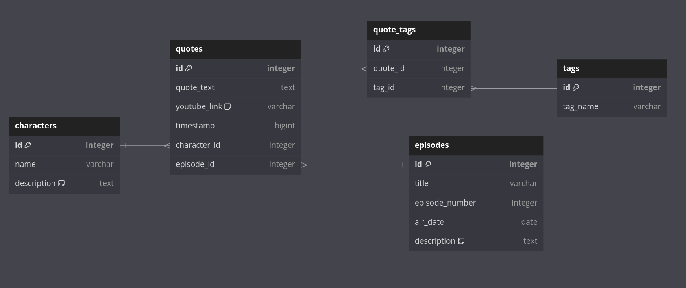

# Kapitan Bomba API

API for the "Kapitan Bomba" project, built with NestJS and TypeORM, using MySQL as the database. This API is designed to manage characters, episodes, quotes, and tags from the "Kapitan Bomba" series.

## Table of Contents

- [Installation](#installation)
- [Environment Variables](#environment-variables)
- [Database Migrations](#database-migrations)
- [Seeding the Database](#seeding-the-database)
- [Project Structure](#project-structure)
- [Database Structure](#database-structure)
- [Available Scripts](#available-scripts)

## Installation

1. **Clone the repository**:

   ```bash
   git clone https://github.com/your-repo/kapitan-bomba-api.git
   cd kapitan-bomba-api
   ```

2. **Install dependencies**:

   Make sure you have `yarn` installed. Then, run:

   ```bash
   yarn install
   ```

3. **Install TypeORM CLI globally**:

   ```bash
   yarn global add typeorm ts-node
   ```

## Environment Variables

Create a `.env` file in the root of your project and configure the following environment variables:

```plaintext
DB_HOST=your_database_host
DB_PORT=your_database_port
DB_USER=your_database_user
DB_PASS=your_database_password
DB_NAME=your_database_name
```

## Database Migrations

### Running Migrations

To run database migrations, use:

```bash
yarn migration:run
```

### Creating a New Migration

To create a new migration, use:

```bash
yarn migration:create
```

### Generating a Migration Based on Entities

To automatically generate a migration based on your entities:

```bash
yarn migration:generate
```

### Reverting the Last Migration

To revert the last migration, use:

```bash
yarn migration:revert
```

## Seeding the Database

There are two options to seed the database with initial data:

### Option 1: Using a Migration

You can use a dedicated migration to seed the database with initial data. This migration (`1726223236209-schema-update.ts`) is located in the `src/database/migrations/` folder. To run the migration and seed the data, use:

```bash
yarn migration:run
```

This will apply all pending migrations, including the one that seeds the data.

### Option 2: Using a Seed Script

Alternatively, you can use a separate seed script (`seed.ts`) along with a JSON file (`seed-data.json`) to populate the database:

1. **Run the seed script**:

   ```bash
   yarn seed
   ```

   This script will populate the database with predefined data from the `src/database/seeds/seed-data.json` file.

2. **Editing Seed Data**:

   You can modify the data in the `src/database/seeds/seed-data.json` file to change what initial data is loaded into the database. This file contains JSON data for characters, episodes, quotes, and tags that will be inserted by the seeding script.

## Project Structure

The current project structure is organized as follows:

```
src/
├── api/
│   ├── api.controller.ts
│   ├── api.module.ts
│   ├── api.service.ts
│   └── entities/
│       ├── characters.entities.ts
│       ├── episodes.entities.ts
│       ├── quotes.entities.ts
│       ├── quoteCharacters.entities.ts
│       ├── tags.entities.ts
│       ├── quoteTags.entities.ts
│       └── index.ts
├── database/
│   ├── data-source.ts
│   ├── seeds/
│   │   └── seed-data.json
│   ├── seed.ts
│   └── migrations/
│       └── 1726223236209-schema-update.ts
└── main.ts
```

## Database Structure

The database structure is organized as follows:



- **Characters**: Stores characters information.
- **Episodes**: Stores information about episodes.
- **Quotes**: Contains quotes and references to characters and episodes.
- **Tags**: Stores tags that can be associated with quotes.
- **QuoteTags**: Intermediate table for many-to-many relationship between quotes and tags.

## Available Scripts

- **`yarn migration:create`**: Creates an empty migration file in `src/database/migrations/`.
- **`yarn migration:generate`**: Generates a migration file based on entity changes in `src/database/migrations/`.
- **`yarn migration:run`**: Runs all pending migrations.
- **`yarn migration:revert`**: Reverts the last migration that was run.
- **`yarn seed`**: Seeds the database with initial data from `src/database/seeds/seed-data.json`.

## Logging and Error Handling

All database operations are logged for errors, queries, and schema changes. Check the console output for any errors during migrations or seed operations.

## License

This project is licensed under the MIT License.